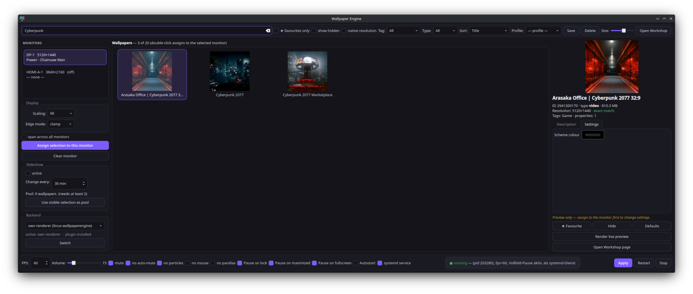

# we-wallpaper

[](https://github.com/pbaetz99/we-wallpaper/actions/workflows/tests.yml)

Wallpaper Engine workshop wallpapers on **KDE Plasma 6 / Wayland**, with the
quality-of-life pieces the bare renderer does not have: a graphical library and
properties editor, per-monitor assignment, profiles, a slideshow, global
shortcuts, and — most importantly — **automatic pausing** so the renderer stops
burning GPU power whenever nobody can see the wallpaper.

Built on [linux-wallpaperengine](https://github.com/Almamu/linux-wallpaperengine)
by Almamu, which does the actual rendering. This project only drives it.

> **Status:** built for one machine (Nobara 44, Plasma 6.7 on Wayland, NVIDIA
> RTX 4080, a 32:9 ultrawide plus a 4K second monitor). Every feature below
> was tested there; `we-wallpaper doctor` tells you what your machine is
> missing. The UI is English by default and German under a German locale.
> Code comments are German.

## Why the pausing matters

Measured on the reference machine with a scene wallpaper at 5120×1440:

| state                | GPU power | GPU util | CPU  |
|----------------------|-----------|----------|------|
| rendering at 60 fps  | ~61 W     | 37 %     | 6.5 %|
| rendering at 30 fps  | ~53 W     | 35 %     | 2.5 %|
| frozen (`SIGSTOP`)   | ~45 W     | 25 %     | 0 %  |

The wallpaper is invisible while the screen is locked, while a game runs
fullscreen, or while a maximized window covers every monitor. `we-wallpaper-watch`
freezes the renderer in exactly those situations and thaws it afterwards.

## Two backends — pick one

| | own renderer (`linux-wallpaperengine`) | KDE plugin (`wallpaper-engine-kde-plugin`) |
|---|---|---|
| desktop icons | **hidden** (layer-shell surface sits above Plasma's desktop, on every `--layer`) | visible |
| per-wallpaper properties, live preview, profiles, slideshow | yes | properties via the plugin's own dialog |
| automatic pausing (fullscreen / lock / maximized) | yes, with ~19 W GPU saved | the plugin's own pause modes |
| global shortcuts Meta+Shift+W/N/P | yes | — |
| rendering | scene, video, web | depends on the plugin build |

Switch in the GUI (*Backend* box) or on the command line:

```bash
we-wallpaper backend            # show which one is active
we-wallpaper backend kde-plugin # stop own renderer, activate the plugin with the assigned wallpaper
we-wallpaper backend native     # back to the own renderer
```

Switching uses Plasma's scripting interface (`org.kde.PlasmaShell
evaluateScript`) to set the wallpaper plugin of every desktop and write the
plugin's configuration (`WallpaperWorkShopId`, `SteamLibraryPath`, `Fps`,
`Volume`, `MuteAudio`, `MouseInput`). The plugin must be installed
(Fedora/Nobara: COPR `kylegospo/wallpaper-engine-kde-plugin`; note that this
package ships only the QML library — the Plasma package part is installed with
`kpackagetool6 -t Plasma/Wallpaper -i plugin` from the upstream checkout).
With the own renderer active, **Meta+Shift+W** still toggles the wallpaper off
and on instantly, which frees the icons without switching backends.

## Screenshot



*Library with search filter, monitor list with the Backend box, properties editor for the selected wallpaper.*

## Components

| file | role |
|------|------|
| `bin/we-wallpaper` | control script: `doctor`, start/stop/restart/status, profiles, slideshow, `toggle`, `next`, `thaw`, `backend`, systemd install |
| `bin/we-wallpaper-gui` | PySide6 application: library grid, filters, favourites, properties editor, live preview, profiles, tray icon |
| `bin/we-wallpaper-watch` | pause daemon: freezes the renderer on fullscreen / lock / maximized / manual; owns the KWin script and the global shortcuts |
| `share/fullscreen-watch.js` | KWin script: detects fullscreen and maximized windows, registers the shortcuts, reports over D-Bus |
| `systemd/*.service` | user units (auto-restart on crash, bound to the Plasma session) |
| `packaging/` | RPM spec and `build-rpm.sh` (builds locally with `rpmbuild`) |
| `tests/` | unit tests (`tests/run.sh`), run by CI on every push |
| `contrib/we-ambient-guard` | unrelated to wallpapers: works around an OpenRGB Effects-plugin deadlock and duplicate OpenRGB starts; see below |

## Requirements

- KDE Plasma 6 on Wayland (KWin must support `wlr-layer-shell`; it does).
- A built `linux-wallpaperengine` (default path
  `~/.local/src/linux-wallpaperengine/build/output/linux-wallpaperengine`,
  override with `WE_RENDERER=/path/to/binary`).
- **Wallpaper Engine installed through Steam** (via Proton) — the renderer needs
  its `assets/` folder — plus subscribed Workshop wallpapers in
  `~/.local/share/Steam/steamapps/workshop/content/431960/`.
- Python 3 with `PySide6` (Fedora: `python3-pyside6`), `kscreen-doctor`,
  `ffprobe` (for real video resolutions).

## Install

```bash
git clone https://github.com/pbaetz99/we-wallpaper.git
cd we-wallpaper
./install.sh            # copies to ~/.local/bin, ~/.local/share, adds the menu entry
we-wallpaper doctor     # checks every prerequisite and says what is missing
we-wallpaper list       # shows your subscribed wallpapers
we-wallpaper-gui        # assign wallpapers, click "Apply"
```

Or build an RPM (`rpm-build`, `rpmdevtools`, `systemd-rpm-macros`):

```bash
packaging/build-rpm.sh  # writes ~/rpmbuild/RPMS/noarch/we-wallpaper-*.rpm
```

To run as systemd user services (recommended — auto-restart, session-bound):

```bash
we-wallpaper install-service
```

This removes any `~/.config/autostart/we-wallpaper.desktop` so nothing starts
twice. `we-wallpaper uninstall-service` reverts it.

## Usage

```
we-wallpaper doctor            # prerequisites check with hints
we-wallpaper start|stop|restart|status|list
we-wallpaper backend [native|kde-plugin]
we-wallpaper toggle            # renderer off/on, keeps the watcher alive
we-wallpaper next              # advance the slideshow now
we-wallpaper thaw              # emergency: wake a frozen renderer
we-wallpaper profile <name>    # apply a saved profile
we-wallpaper profiles
```

Global shortcuts (registered by the KWin script; change them in
System Settings → Shortcuts → KWin):

| shortcut | action |
|----------|--------|
| Meta+Shift+W | wallpaper off / on (frees the desktop icons) |
| Meta+Shift+N | next wallpaper from the slideshow pool |
| Meta+Shift+P | manual pause / resume |

## Configuration

`~/.config/we-wallpaper.json` is the single source of truth; the GUI writes it.

```jsonc
{
  "screens": {
    "DP-1": { "id": "2941300170", "scaling": "fit", "clamp": "clamp",
              "properties": { "schemecolor": "0.9 0.1 0.1" } }
  },
  "spans": [],                 // [{outputs:[...], id, scaling, clamp, properties}]
  "layer": "bottom",           // background|bottom|top|overlay
  "renderer": "",              // path to linux-wallpaperengine; empty = default, WE_RENDERER wins
  "backend": "native",         // native | kde-plugin
  "per_output": false,         // one renderer process per monitor -> pausing per monitor
  "fps": 30, "volume": 15, "silent": false, "noautomute": true,
  "disable_particles": false, "disable_mouse": false, "disable_parallax": false,
  "pause_on_fullscreen": true, "pause_on_lock": true, "pause_on_maximized": true,
  "rotation": { "enabled": false, "minutes": 30, "pool": [], "order": "random" },
  "profiles": {}, "favorites": [], "hidden": []
}
```

Per-wallpaper properties are the ones the wallpaper author exposes in
`project.json`; the GUI renders them as switches, sliders, colour pickers and
combos, honouring the author's `condition` rules. They are passed to the
renderer as `--set-property name=value`.

## How the pausing works

KWin on Wayland does not implement `wlr-foreign-toplevel-management`, so the
renderer cannot detect fullscreen windows by itself. `fullscreen-watch.js` runs
inside KWin, watches window state, and calls `we-wallpaper-watch` over D-Bus
(`org.wewallpaper.Watch`). The daemon freezes the renderer with `SIGSTOP` and
resumes it with `SIGCONT`.

With `"per_output": true` there is one renderer process per monitor (spans stay
one process) and a supervisor inside the systemd unit restarts a crashed one.
The daemon then freezes only the process whose monitor is covered — a
fullscreen game on one screen no longer stops the wallpaper on the other. In
the default single-process mode the rule is "every monitor covered".

A frozen process depends on somebody waking it up, so there are several safety
nets: the daemon wakes the renderer on start and on exit, a watchdog checks
every 5 s that the process state matches the pause reasons, `we-wallpaper status`
frees a frozen renderer when no daemon is alive (the GUI polls status every
5 s), and `we-wallpaper thaw` exists for emergencies. The current reason is
written to `~/.local/state/we-wallpaper-pause.json` and shown by `status`.

## contrib: we-ambient-guard (OpenRGB)

Not about wallpapers. On the reference machine the OpenRGB Effects plugin's
"Ambient" effect died every time the display powered off: both the Effects and
VisualMap plugins hit a Qt deadlock (`Dead lock detected in
BlockingQueuedConnection`) and the effect thread never recovered. The guard
follows the journal for that message and restarts OpenRGB through its systemd
unit. It also removes duplicate OpenRGB instances that Plasma's session restore
starts on top of the autostart entry (`excludeApps` in `ksmserverrc` did not
prevent that on the Wayland path).

Set `WE_OPENRGB_UNIT` if your autostart unit is not
`app-OpenRGB@autostart.service`. Note that a restarted OpenRGB only brings the
effect back if an effect profile with *AutoStart* is saved in the plugin.

## Things that bit me (so they don't bite you)

- `pkill -f name` matches the shell that runs it. Every process lookup here
  goes through `/proc/<pid>/exe` or an exact argv basename instead.
- Own systemd user units must not be `After=plasma-workspace.target` *and*
  `WantedBy=plasma-workspace.target` — that is an ordering cycle and systemd
  silently deletes the start job. Use `After=plasma-core.target`.
- `QDBusConnection.connect(...)` in PySide6 wants the slot in `SLOT()` form:
  `"1onLockChanged(bool)"`, with the leading digit.
- Steam's workshop preview images are square crops; they say nothing about a
  wallpaper's aspect ratio. Only video wallpapers have a measurable resolution.
- Qt style sheets cannot embed image data or draw CSS triangles; the combo-box
  arrows are PNGs generated at runtime.

## Roadmap / known gaps

- **COPR / distribution packages.** The spec builds locally; publishing to a
  COPR is the next step.
- **KDE-plugin rendering** on this machine still showed a black wallpaper with
  the COPR library (`git.638`) and the upstream QML package, tried both at HEAD
  and at upstream commit #638 — a mismatch between the two halves. The switch
  itself works (icons visible, plugin active, config written); rendering needs
  a plugin built from one consistent source tree.
- **Per-output span pausing.** A span is one process; a fullscreen window on one
  of its monitors pauses the whole span.
- More translations than German/English.

## License

MIT — see `LICENSE`. `linux-wallpaperengine` has its own license; this project
only launches it as a separate process.
